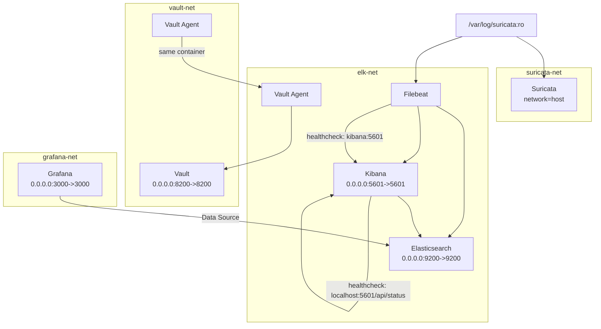

# Suricata for network security monitoring

This repository provides a containerized ELK stack setup integrated with Suricata for network security monitoring. It includes configuration files, Docker resources, and scripts for easy deployment, as well as organized directories for customizing Suricata rules and ELK components.

## System Diagram



## Bootstrap and Cleanup

### Running the Bootstrap

To start the stack, use:

```sh
./bootstap.sh
```

### Cleanup

To stop and remove all containers, networks, and volumes, run:

```sh
docker compose down --volumes
```

Example output:

```
WARN[0000] The "KIBANA_SYSTEM_PASSWORD" variable is not set. Defaulting to a blank string. 
WARN[0000] The "FILEBEAT_INTERNAL_PASSWORD" variable is not set. Defaulting to a blank string. 
WARN[0000] The "ELASTIC_PASSWORD" variable is not set. Defaulting to a blank string. 
[+] Running 10/10
 ✔ Container filebeat       Removed
 ✔ Container grafana        Removed
 ✔ Container vault-agent    Removed
 ✔ Container kibana         Removed
 ✔ Container vault          Removed
 ✔ Container elasticsearch  Removed
 ✔ Volume elk_grafana_data  Removed
 ✔ Network elk_vault-net    Removed
 ✔ Network elk_elk-net      Removed
 ✔ Volume elk_esdata        Removed
```

### Deep Cleanup

To remove all untracked files, directories, and generated secrets, run:

```sh
git clean -xfd
```

Example output:

```
Removing .env
Removing passwords.txt
Removing secrets/
Removing vault-creds/
```

> **Note:**  
> - The following services (kibana|filebeat) may take approximately 2 minutes to become healthy after startup.  
> - You can monitor their health status using `docker ps` and `watch` commands.  
> - Example: `watch docker ps` will refresh the container status every 2 seconds, allowing you to observe when the containers transition to a healthy state.
